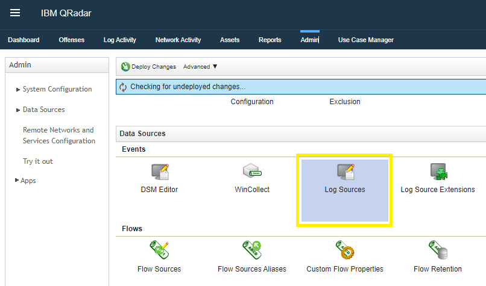
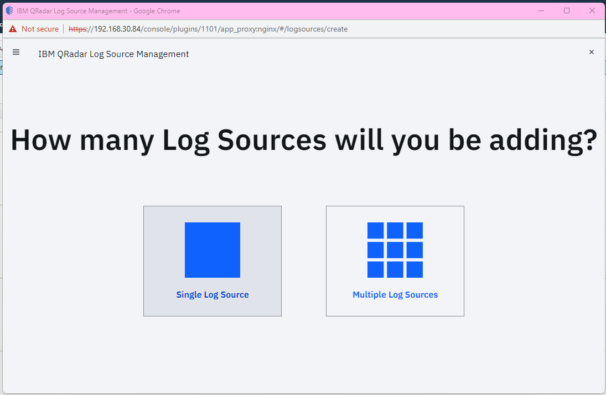
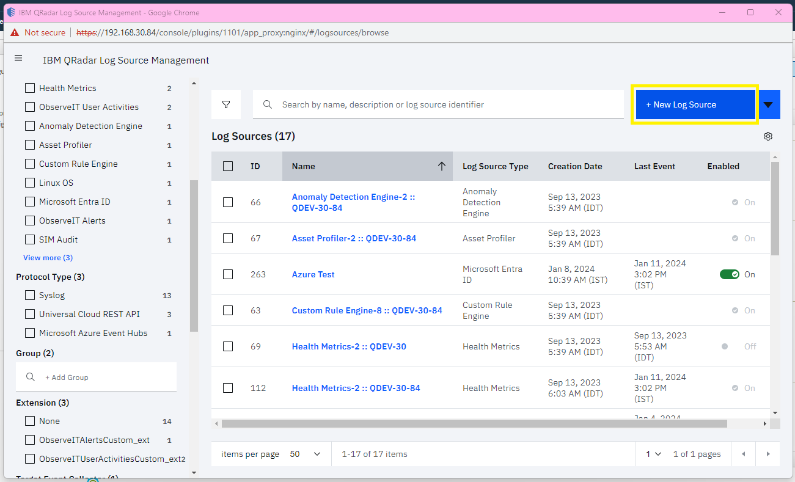
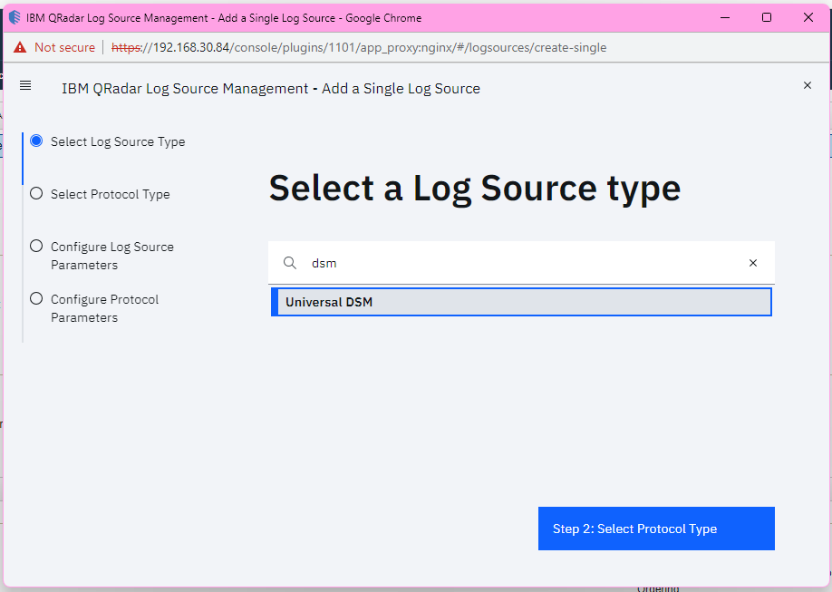
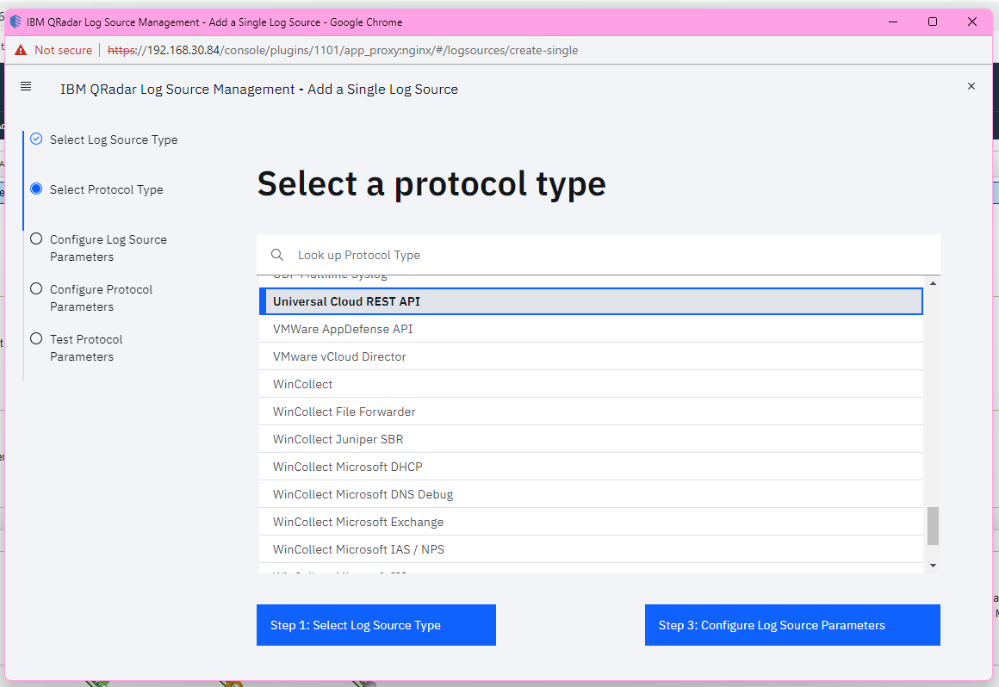
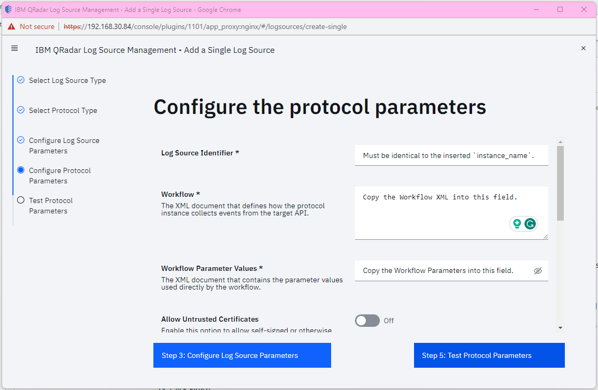
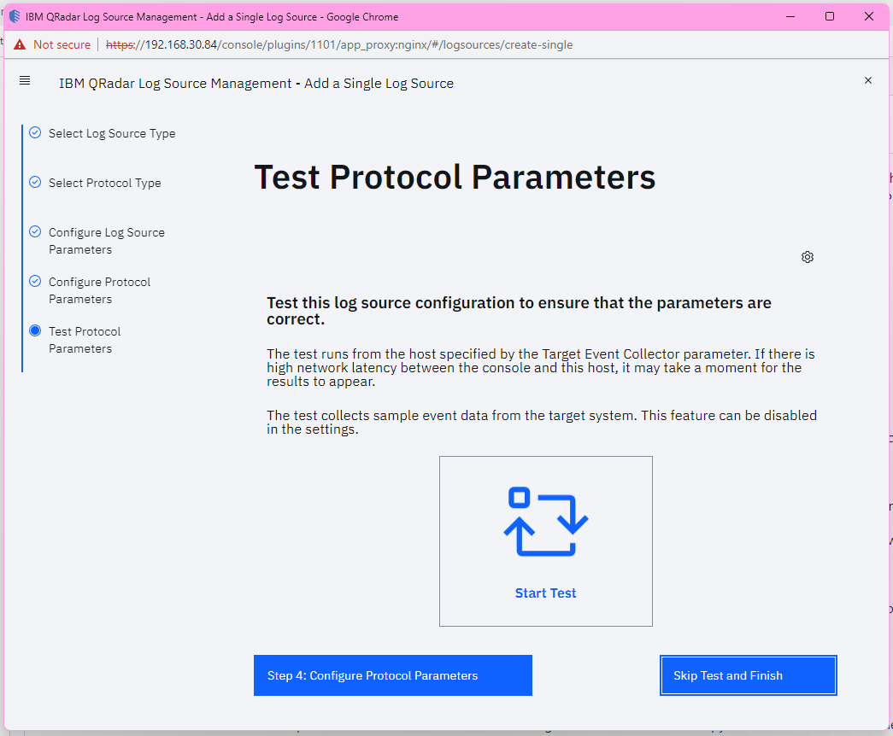

# Boomi Parameters Configuration
| Parameter                        | Name                                    | Required (True/False) | Type            | Description                                                                                           | Default Value |
|----------------------------------|-----------------------------------------|-----------------------|-----------------|-------------------------------------------------------------------------------------------------------|---------------|
| `identifier`                     | Log Source Identifier                   | True                  | String          | The log source identifier to post the events to.                                                     |               |
| `base_url`                       | Base URL                               | True                  | String          | Dynamic 365 CRM base URL.                                                                                  |  |
| `username`                      | Username                        | True                  | Authentication  | user name. |               |
| `token`                  | Token                              | True                  | Authentication  | token. |               |
| `start_fetch_time`                | Initial Event Start Time Date                         | False                 | String          | The date time from which events will be initially retrieved, For example: "2020-10-16T15:21:57Z".               |    1 Hour ago    |
| `sleep_time_in_seconds`                | Sleep Time in Seconds | False                 | Number          | The downtime for the connector after it is in sync with the server (Min: 0).                          | `20` |

##

# How to Generate Token
1. Log on to your Boomi instance.

2. Navigate to repositories page.

3. In the Repositories page, click the repository name.

4. Select the Configure tab, and click Generate New.

5. Click OK in the confirmation dialog to confirm the request.

6. You return to the Configure tab. The 'My Authentication Token' field updates to show the new authentication token for your account.

# QRadar Log Source Configuration
If you want to ingest data from an endpoint using Universal Rest API Protocol, configure a log source on the QRadar® Console using the Workflow field so that the defined endpoint can communicate with QRadar by using the Universal Rest API protocol.

1. Log in to QRadar.

2. Click the Admin tab.

3. To create DSM, click the DSM editor app icon.

4. Then click Create New and name it "Boomi".

4. To create the log source, click the QRadar Log Source Management app icon.

5. Click New Log Source > Single Log Source.

6. On the Select a Log Source Type page, Select a Log Source Type (Boomi) and click Select Protocol Type (Universal Rest API).

7. On the Select a Protocol Type page, select a protocol and click Configure Log Source Parameters.

8. On the Configure the Log Source parameters page, configure the log source parameters and click Configure Protocol Parameters.

9. On the Configure the Protocol Parameters page, configure the protocol-specific parameters (Workflow and Workflow Parameter Values).

10. In the Test protocol parameters window, click Start Test.

10. To fix any errors, click Configure Protocol Parameters. Configure the parameters and click Test Protocol Parameters.

11. Click Finish

##

- The log source identifier must be identical to the inserted `identifier`.
- Copy the Workflow XML into the Workflow field.
- Populate the Workflow Parameters according to the table above and copy it into the Workflow Parameters Values field.
- Make sure to turn off the Coalescing Events to avoid grouping of the events on the basis of Source and Destination IP.
- It is advised to open an individual log source for report types that fetch large amount of data.
